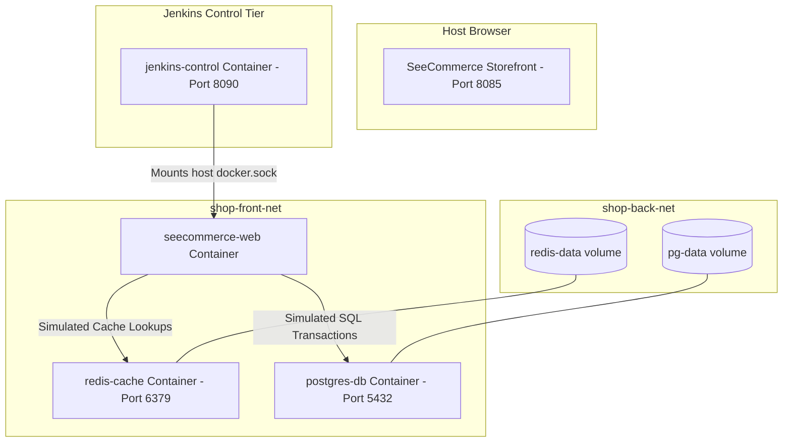

# SeeCommerce DevOps Microservices Stack 🐳🚀

Welcome to **SeeCommerce**, a fully containerized cloud catalog storefront and real-time DevOps metrics simulator.

This repository serves as a practical sandbox to understand:
1. **Multi-Stage builds** via a custom optimized `Dockerfile`.
2. **Container orchestration & networking** using `docker-compose.yml` linking a locally built web app with Docker Hub images.
3. **Continuous Integration & Continuous Deployment (CI/CD)** powered by a professional `Jenkinsfile` pipeline.

---

## 🏗️ Architecture Stack Diagram



---

## ⚡ How to Spin up the Sandbox Stack

### Method 1: Docker Compose (Direct Startup)
If you have **Docker Desktop** running:
1. Open PowerShell/Terminal inside this `seecomerce/` folder.
2. Spin up the application stack:
   ```bash
   docker compose up -d --build
   ```
3. Open your browser and navigate to: **[http://localhost:8085](http://localhost:8085)**
4. Open the shopping cart ledger, add products, and click **Commit Checkout Transaction** to view live Postgres SQL insert queries and Redis caching logs in real-time!

---

## 🛠️ Jenkins CI/CD Setup

We have integrated a declarative **Jenkinsfile** pipeline. It has 5 stages:
1. **Checkout & Lint**: Pulls the repository code and checks the syntax of your compose file and Dockerfile.
2. **Build Custom Image**: Runs a local docker build to construct the `seecommerce-web` frontend using our custom multi-stage Dockerfile.
3. **Integration Tests**: Tests the linkages and networks dry-runs.
4. **Compose Orchestration Up**: Deploys all 3 containers with fresh recreations.
5. **Smoke Test Check**: Uses curl checks inside Jenkins to confirm the server is serving pages successfully on port 8085.

### Spin up Local Jenkins in 1-Click:
We have provided a native PowerShell automated runner `run-jenkins.ps1` that configures Jenkins to run on your local machine, pre-linked to your Docker engine:

1. Open a PowerShell terminal as Administrator in this folder.
2. Execute the helper script:
   ```powershell
   ./run-jenkins.ps1
   ```
3. The script will pull the LTS image, mount the local host Docker socket (`/var/run/docker.sock`), spin up Jenkins on **[http://localhost:8090](http://localhost:8090)**, and display your **Administrator Setup Password**.
4. Log in, select recommended plugins, and create a **Pipeline** project named `SeeCommerce` pointing to this folder's `Jenkinsfile` to execute the pipeline!
